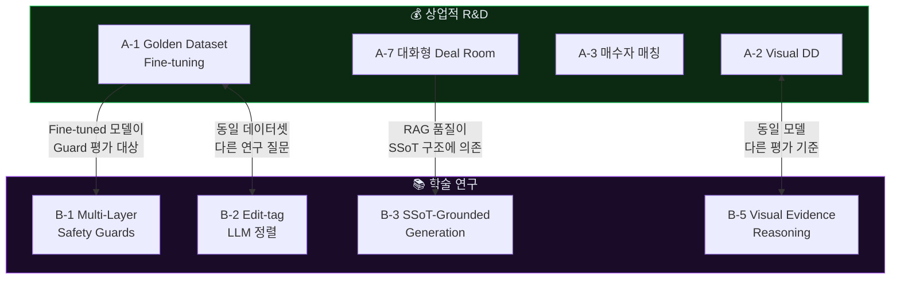

# JS CRE AI Ecosystem — AI R&D 유망 연구 주제 도출

---

## Part A. 상업적 부가가치 창출 — AI R&D 8대 주제

---

### A-1. Golden Dataset 기반 CRE 도메인 LLM Fine-tuning

| 항목 | 내용 |
|---|---|
| **현재 상태** | FullIM에 Golden Dataset 파이프라인 구축 완료 (`ai_draft` → `expert_revision` → `edit_tags` → `redaction` → `training_rights`) |
| **R&D 내용** | 축적된 AI초안↔전문가패치 쌍으로 CRE 도메인 특화 LLM을 fine-tune |
| **기대 성과** | 전문가 패치 필요량 40~60% 감소 → Expert 비용 절감 → 마진 확대 |
| **난이도** | ★★★★☆ |
| **연결 시스템** | FullIM (Golden Dataset) → 전체 시스템 AI 품질 향상 |

```
학습 데이터 구조:
  Input:  Building SSoT Full + section_type + target_output
  Output: expert_revision (전문가가 수정한 최종본)
  Label:  edit_tags (overclaim_removed, risk_balance_added, ...)
  Filter: training_rights == "allowed_golden_dataset"
          redaction_status == "redacted"
```

**킬러 지표**: "Expert Patch Rate" — AI 초안이 전문가 수정 없이 통과하는 비율. 현재 추정 20~30% → 목표 60~70%.

---

### A-2. 사진 기반 건물 상태 자동 진단 (Visual Due Diligence)

| 항목 | 내용 |
|---|---|
| **현재 상태** | AiPage에 `VisualClassificationAgent` 구현 — `risk_tags`, `facility_tags` 분류 |
| **R&D 내용** | 사진에서 균열, 누수 흔적, 노후 설비, 위반건축물 징후를 자동 감지하는 Vision 모델 개발 |
| **기대 성과** | 현장 실사(DD) 전 사전 리스크 스크리닝 → FullIM `building_condition_physical_review` 섹션에 자동 반영 |
| **난이도** | ★★★★★ |
| **연결 시스템** | AiPage (사진 업로드) → FullIM (건물 상태 섹션) |

```
신규 태그 체계:
  structural_risk:  crack_major | crack_minor | water_damage | settlement_sign
  mep_risk:         aging_hvac | exposed_wiring | corroded_pipe
  compliance_risk:  unpermitted_extension | fire_exit_blocked | signage_violation
  severity:         info | warning | critical
```

**상업 임팩트**: 감정평가사/건축사 사전 스크리닝 자동화 → Expert Full Build 패키지의 원가 절감.

---

### A-3. 매수자-매물 시맨틱 매칭 엔진

| 항목 | 내용 |
|---|---|
| **현재 상태** | DealCard에 `Buyer Intent Lite` + `Buyer Fit Memo` 구현 (텍스트 기반 1:1 매칭) |
| **R&D 내용** | Buyer Intent와 Building SSoT를 임베딩 공간에 매핑하여 N:M 자동 매칭 |
| **기대 성과** | "이 매수자에게 맞는 매물 3건 추천" → 브로커 생산성 극대화 |
| **난이도** | ★★★☆☆ |
| **연결 시스템** | DealCard (양측 데이터) → FullIM (매칭된 매수자 맞춤 IM) |

```
임베딩 설계:
  Building Vector = f(area_signal, price_band, asset_type, vacancy, fit_summary)
  Buyer Vector    = g(budget, region, purpose, must_have, risk_tolerance)
  Match Score     = cosine_similarity(Building, Buyer) + penalty(deal_breaker)
```

---

### A-4. 임대 수요 예측 모델 (Demand Forecasting)

| 항목 | 내용 |
|---|---|
| **현재 상태** | AiPage에 `Demand Signal Summary` 축적 (inquiry_count, qualified_count, top_tenant_categories) |
| **R&D 내용** | 문의 데이터 + 공간 특성 + 시기로 "이 공간에 언제, 어떤 업종의 임차인이 올 확률" 예측 |
| **기대 성과** | 임대료 설정 최적화, 공실 기간 예측 → FullIM NOI 분석 정확도 향상 |
| **난이도** | ★★★★☆ |
| **연결 시스템** | AiPage (수요 데이터) → FullIM (NOI·수익률 섹션) |

---

### A-5. 자동 비교 사례(Comparable) 수집 및 보정 엔진

| 항목 | 내용 |
|---|---|
| **현재 상태** | FullIM `valuation_logic_comparables` 섹션은 수동 입력 또는 AI 추론 의존 |
| **R&D 내용** | 공공 데이터(실거래가, 건축물대장, 토지대장) + 내부 SSoT를 결합하여 자동 비교 사례 수집 및 보정 계수 산출 |
| **기대 성과** | Valuation 섹션의 데이터 밀도 10배 증가 → Expert Patch 필요성 감소 |
| **난이도** | ★★★★☆ |
| **연결 시스템** | 외부 공공 API → DealCard (시그널 강화) → FullIM (가치평가 섹션) |

---

### A-6. 멀티모달 IM 생성 (텍스트 + 차트 + 지도 + 사진)

| 항목 | 내용 |
|---|---|
| **현재 상태** | FullIM은 마크다운 텍스트 중심 출력. PPTX는 outline placeholder만 존재 |
| **R&D 내용** | SSoT 데이터에서 차트(수익률 시나리오), 지도(입지 분석), 사진(AiPage Visual Album)을 자동 삽입하는 멀티모달 IM 생성기 개발 |
| **기대 성과** | "AI가 만든 IM인데 사람이 만든 것 같다" → Buyer-ready 승인률 향상 |
| **난이도** | ★★★★★ |
| **연결 시스템** | AiPage (사진/앨범) + FullIM (텍스트/데이터) → PDF/PPTX 렌더링 |

---

### A-7. 대화형 IM 네비게이터 (Conversational Deal Room)

| 항목 | 내용 |
|---|---|
| **현재 상태** | FullIM `dealroom_qna_pack` — 예상 질문 + 답변 준비 상태 |
| **R&D 내용** | 매수자가 IM을 읽으면서 자연어로 질문하면 SSoT + IM 섹션에서 답변하는 RAG 기반 챗봇 |
| **기대 성과** | Deal Room 체류 시간 증가 → 거래 전환율 향상 |
| **난이도** | ★★★☆☆ |
| **연결 시스템** | FullIM (IM 컨텐츠 + Q&A Pack) + DealCard (Buyer Intent) |

---

### A-8. 브로커 행동 패턴 기반 리드 스코어링

| 항목 | 내용 |
|---|---|
| **현재 상태** | 3개 시스템 모두 `activity_events` 테이블에 행동 로그 축적 |
| **R&D 내용** | 브로커/매수자의 행동 시퀀스(딜카드 생성 → Gate 요청 → IM 열람 → 문의)로 거래 성사 확률 예측 |
| **기대 성과** | "이 리드는 성사 확률 73%" → 브로커가 집중할 딜 우선순위 자동 정렬 |
| **난이도** | ★★★☆☆ |
| **연결 시스템** | DealCard + AiPage + FullIM (통합 이벤트 분석) |

---

### 상업적 R&D 우선순위 매트릭스

| 주제 | 부가가치 | 실현 가능성 | 데이터 준비도 | 우선순위 |
|---|---|---|---|---|
| A-1 Golden Dataset Fine-tuning | ★★★★★ | ★★★☆☆ | ★★★★☆ | 🥇 |
| A-3 매수자-매물 매칭 | ★★★★☆ | ★★★★☆ | ★★★★☆ | 🥈 |
| A-7 대화형 Deal Room | ★★★★☆ | ★★★★☆ | ★★★★★ | 🥉 |
| A-8 리드 스코어링 | ★★★★☆ | ★★★★☆ | ★★★☆☆ | 4 |
| A-2 Visual Due Diligence | ★★★★★ | ★★☆☆☆ | ★★★☆☆ | 5 |
| A-4 임대 수요 예측 | ★★★★☆ | ★★★☆☆ | ★★★☆☆ | 6 |
| A-5 자동 Comparable | ★★★★☆ | ★★★☆☆ | ★★☆☆☆ | 7 |
| A-6 멀티모달 IM | ★★★★★ | ★★☆☆☆ | ★★★★☆ | 8 |

---

## Part B. 학술적 가치 창출 — 7대 연구 주제

---

### B-1. Domain-Constrained Document Generation with Multi-Layer Safety Guards

> **학술 가치**: LLM 출력에 도메인 특화 제약 조건(금융 과장 금지, 정보 유출 방지, 법적 경계 준수)을 동시 적용하는 멀티레이어 가드레일 아키텍처의 형식화

| 항목 | 내용 |
|---|---|
| **연구 질문** | 독립적으로 설계된 N개의 가드레일(Financial, Risk, Disclosure)을 조합할 때, 안전성은 어떻게 보장되며, 표현력(expressiveness)은 얼마나 감소하는가? |
| **기여점** | ① 가드레일 조합의 형식적 안전성 증명 ② 표현력-안전성 트레이드오프 정량화 ③ CRE 도메인 벤치마크 데이터셋 |
| **데이터** | FullIM의 gate-review-service.ts (8가지 Gate) + Financial Guardrails (docs/17) + Risk Boundary (docs/18) + Disclosure Guard (docs/19) |
| **학회 타겟** | ACL, EMNLP, NAACL (NLP Safety & Trustworthy AI 트랙) |

```
연구 설계:
  실험 1: 단일 Guard vs 2-Guard vs 3-Guard 조합의 P0 위반 차단률
  실험 2: Guard 개수 증가에 따른 유용한 표현(deal point, risk balance)의 보존률
  실험 3: 한국어 CRE 도메인에서의 "과장 표현" 분류기 F1 스코어
```

---

### B-2. Expert-in-the-Loop: Structured Feedback for Domain LLM Alignment

> **학술 가치**: RLHF의 도메인 특화 변형 — 비구조적 선호도 피드백이 아닌 **구조화된 편집 태그(edit_tags)**를 통한 LLM 정렬

| 항목 | 내용 |
|---|---|
| **연구 질문** | 전문가의 구조화된 편집 태그(overclaim_removed, risk_balance_added 등 14종)가 비구조적 선호도 레이블보다 도메인 LLM 정렬에 더 효과적인가? |
| **기여점** | ① Edit-tag 기반 정렬이 RLHF 대비 도메인 적합도를 높이는지 정량 비교 ② "Professional document" 도메인에서의 정렬 벤치마크 최초 제시 |
| **데이터** | FullIM Golden Dataset: `ai_draft` + `expert_revision` + `edit_tags` (14종) + `issue_categories` (10종) |
| **학회 타겟** | NeurIPS, ICML (Alignment & RLHF 트랙), AAAI |

---

### B-3. SSoT-Grounded Generation: Reducing Hallucination via Structured Truth Layers

> **학술 가치**: 비정형 프롬프트 대신 **구조화된 진실 레이어(SSoT)**를 LLM 컨텍스트로 제공할 때, 환각(hallucination)이 얼마나 감소하는가?

| 항목 | 내용 |
|---|---|
| **연구 질문** | 14개 JSONB 레이어로 구조화된 Building SSoT Full이 자유 텍스트 컨텍스트 대비 사실성(factuality)과 환각률을 어떻게 변화시키는가? |
| **기여점** | ① 구조화 정도(schema richness)와 환각률의 정량적 관계 ② CRE 도메인 환각 분류 체계 (invented_fact, exaggerated_claim, unsupported_conclusion) |
| **데이터** | Building SSoT Full (14 레이어) vs 같은 정보의 자유 텍스트 버전 → 동일 질문에 대한 생성 결과 비교 |
| **학회 타겟** | ACL, EMNLP (Factuality & Grounding 트랙) |

---

### B-4. Cross-System Privacy Cascade: Information Flow Control Across Autonomous AI Services

> **학술 가치**: 독립적으로 운영되는 복수 AI 시스템 간 데이터 핸드오프 시, 보호 정보(PII, 민감 거래 정보)의 유출을 형식적으로 방지하는 프레임워크

| 항목 | 내용 |
|---|---|
| **연구 질문** | 3개 독립 시스템(DealCard → AiPage → FullIM)이 Handoff Contract로 데이터를 전달할 때, 보호 필드가 절대 복원(reconstruction)되지 않음을 어떻게 보장하는가? |
| **기여점** | ① 크로스시스템 정보 흐름 제어의 형식적 모델 ② `protected_fields_removed` 계약의 정보 이론적 분석 ③ 실제 산업 시스템 기반 사례 연구 |
| **데이터** | DealCard `hidden_fields` → AiPage `protected_fields_removed` → FullIM `disclosure_gate` |
| **학회 타겟** | IEEE S&P, USENIX Security, CCS (Privacy 트랙), PETS |

---

### B-5. Visual Evidence Reasoning for Commercial Real Estate Assessment

> **학술 가치**: 건물 사진에서 "이 공간이 특정 업종에 적합한가?"를 판단하는 멀티모달 추론 — 기존 VQA를 넘어 "전문가 수준의 공간 적합성 추론"

| 항목 | 내용 |
|---|---|
| **연구 질문** | 건물 내/외부 사진 세트로부터 업종별 적합성(Tenant Fit)을 판단할 때, Vision-Language 모델은 전문 브로커 수준의 판단에 얼마나 근접하는가? |
| **기여점** | ① CRE Visual Fitness 벤치마크 데이터셋 (사진 + 업종 + 전문가 라벨) ② 설비 태그(facility_tags)와 분위기 태그(vibe_tags)의 멀티태스크 학습 ③ "증거 강도(evidence_strength)" 자기 인식 메커니즘 |
| **데이터** | AiPage: visual_assets (30+장/공간) + tenant_fit_results + vibe_fit_results |
| **학회 타겟** | CVPR, ECCV (Vision-Language 트랙), AAAI |

---

### B-6. Readiness-Aware Adaptive Document Generation

> **학술 가치**: 데이터 완전성(readiness score)에 따라 생성 전략을 적응적으로 변경하는 조건부 문서 생성 프레임워크

| 항목 | 내용 |
|---|---|
| **연구 질문** | 데이터가 불완전할 때, LLM이 "모르는 것을 안다(knows what it doesn't know)"고 명시하면서도 유용한 문서를 생성하는 최적 전략은? |
| **기여점** | ① Readiness Score ↔ 생성 전략(hedging 강도, 전문가 위임 빈도, 가정 명시 수준)의 관계 모델링 ② "Calibrated Uncertainty in Document Generation" 벤치마크 |
| **데이터** | FullIM readiness-service.ts의 0~100 점수 × 18 섹션의 `status` (ready/partial/blocked) × 생성된 문서 품질 |
| **학회 타겟** | ACL, NeurIPS (Uncertainty & Calibration 트랙) |

---

### B-7. Behavioral Funnel Analysis for AI-Mediated Professional Services

> **학술 가치**: AI가 매개하는 전문 서비스에서 사용자 행동 퍼널을 모델링하고, AI 개입 지점이 전환율에 미치는 인과적 효과를 분석

| 항목 | 내용 |
|---|---|
| **연구 질문** | 3개 AI 시스템의 개입 지점(딜카드 생성, 사진 분류, IM 생성)이 각각 최종 거래 성사 확률에 미치는 인과적 기여도는? |
| **기여점** | ① AI-mediated professional service funnel의 형식적 모델 ② 크로스시스템 이벤트 기반 인과 분석 방법론 ③ CRE 브로커 행동 데이터셋 |
| **데이터** | 3개 시스템의 `activity_events` 통합 (source_app 태그로 구분) |
| **학회 타겟** | KDD, WWW, RecSys, CHI (AI-mediated services 트랙) |

---

### 학술 연구 우선순위 매트릭스

| 주제 | 학술 참신성 | 데이터 준비도 | 실현 가능성 | 추천 순위 |
|---|---|---|---|---|
| B-1 Multi-Layer Safety Guards | ★★★★★ | ★★★★★ | ★★★★☆ | 🥇 |
| B-2 Edit-tag 기반 LLM 정렬 | ★★★★★ | ★★★★☆ | ★★★☆☆ | 🥈 |
| B-3 SSoT-Grounded Generation | ★★★★☆ | ★★★★★ | ★★★★☆ | 🥉 |
| B-6 Readiness-Aware Generation | ★★★★☆ | ★★★★★ | ★★★★☆ | 4 |
| B-4 Cross-System Privacy | ★★★★★ | ★★★★☆ | ★★★☆☆ | 5 |
| B-5 Visual Evidence Reasoning | ★★★★☆ | ★★★☆☆ | ★★★☆☆ | 6 |
| B-7 Behavioral Funnel Analysis | ★★★☆☆ | ★★★☆☆ | ★★★★☆ | 7 |

---

## Part C. 상업-학술 시너지 맵



> **핵심 전략**: Golden Dataset(A-1)과 Edit-tag 정렬(B-2)은 **동일한 데이터를 사용하되 상업적/학술적 질문이 다르다.** 하나의 R&D 투자로 논문과 제품 개선을 동시에 달성할 수 있는 최고 효율 주제이다.
