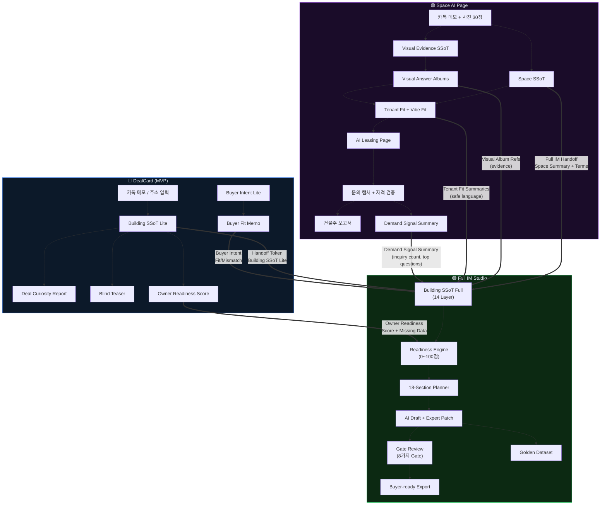
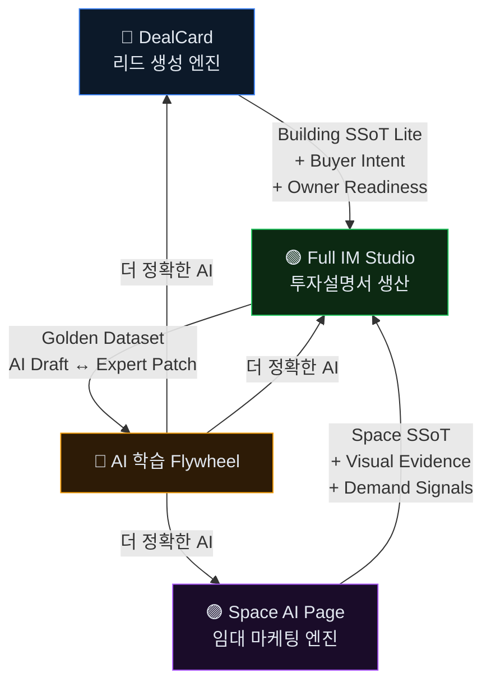

# JS CRE AI Ecosystem — 3-시스템 연계 시너지 & Compound Unfair Advantage 분석

---

## 시스템 개요

| 시스템 | 코드명 | 한줄 정의 | 핵심 SSoT |
|---|---|---|---|
| **DealCard** | `cre-dealcard` | 카톡 메모 → AI 딜카드 + 블라인드 티저 | Building SSoT **Lite** |
| **Space AI Page** | `cre-aipage` | 사진 + 메모 → AI 임대 마케팅 페이지 | Space SSoT + Visual SSoT |
| **Full IM Studio** | `cre-fullim` | SSoT → 18섹션 투자설명서 + 전문가 검증 | Building SSoT **Full** (14개 레이어) |

---

## 1. 데이터 흐름 아키텍처 — SSoT Cascade



---

## 2. 핵심 Handoff Contract 분석

### 2-1. DealCard → Full IM (`@js-ssot/contracts`)

| 필드 | 타입 | 역할 |
|---|---|---|
| `source_building_ssot_lite_id` | UUID | Building SSoT Lite 원본 참조 |
| `source_document_ids` | UUID[] | Deal Curiosity Report, Blind Teaser 참조 |
| `source_buyer_intent_id` | UUID | 매수자 의향서 연결 |
| `source_owner_readiness_id` | UUID | 오너 준비도 점수 연결 |
| `requested_output` | enum | im_lite / buyer_ready_full_im / dealroom_ready_package |
| `package_intent` | enum | ai_self_authoring → expert_full_build 4단계 |
| `building_ssot_lite` | JSONB | 핵심 시그널 데이터 (area_signal, price_band 등) |

**코드 증거:** [handoff.ts](file:///c:/Users/User/cre-dealcard/src/domain/handoff/handoff.ts#L60-L113) — `createHandoff()` 함수가 7개 참조 필드를 하나의 토큰에 집약

### 2-2. Space AI Page → Full IM (`FullIMHandoffPayload`)

| 필드 | 타입 | 역할 |
|---|---|---|
| `space_summary` | object | 면적, 층, 공간유형, 입주가능일 |
| `lease_terms_safe` | object | 보증금/월세/관리비 (공개 허용 시만) |
| `visual_album_refs` | array | Visual Answer Album 참조 (사진 증거) |
| `tenant_fit_summaries` | array | 업종별 적합성 (safe_summary + boundary_note) |
| `vibe_fit_summary` | object | 분위기 분석 (VAD 모델) |
| `demand_signals` | object | 문의 3건, 자격검증 2건, 인기 업종, 인기 질문 |
| `protected_fields_removed` | string[] | 제거된 개인정보 필드 목록 (필수) |

**코드 증거:** [handoff.ts](file:///c:/Users/User/cre-aipage/app/src/contracts/handoff.ts#L27-L106) — Zod 스키마로 전체 핸드오프 계약 정의

---

## 3. 10가지 크로스시스템 시너지

### 시너지 1: SSoT Cascade — 데이터가 버려지지 않는다

```
DealCard가 만든 Building SSoT Lite
  → Full IM이 Building SSoT Full로 확장
    → 14개 레이어에 DealCard 원본이 frozen snapshot으로 보존
```

| DealCard 시그널 | Full IM에서의 매핑 위치 |
|---|---|
| `area_signal` | `asset_identity.area_signal` |
| `price_band` | `asset_identity.price_band` |
| `vacancy_signal` | `physical_fact.vacancy_signal` |
| `fit_summary` | `asset_identity.fit_summary` |
| `hidden_fields` | `disclosure_gate.hidden_fields` |

> 브로커가 카톡에서 입력한 한 줄의 메모가 **3개 시스템을 관통하며 점점 더 풍부한 정보로 진화**한다.

### 시너지 2: 이중 Readiness Engine — 매각 + 임대 동시 준비도 측정

| 시스템 | Readiness 대상 | 점수 범위 | 코드 |
|---|---|---|---|
| DealCard | 오너 매각 준비도 | 0~100 (등기부, 임대차, 사진...) | [owner-readiness.ts](file:///c:/Users/User/cre-dealcard/src/domain/owner/owner-readiness.ts) |
| Space AI Page | 공간 임대 마케팅 준비도 | 0~100 (면적, 임대료, 사진...) | [space.ts](file:///c:/Users/User/cre-aipage/app/src/contracts/space.ts#L181-L207) |
| Full IM | IM 문서 생산 준비도 | 0~100 (데이터 완전성 기반) | [readiness-service.ts](file:///c:/Users/User/cre-fullim/src/domain/readiness/readiness-service.ts) |

**시너지 효과:** DealCard의 `owner_readiness_score`가 Full IM의 `readiness_score`의 **선행 지표** 역할. 오너가 매각 자료를 더 보강할수록 Full IM 준비도도 함께 올라감.

### 시너지 3: Visual Evidence Pipeline — 사진이 증거가 된다

```
Space AI Page: 30장 사진 → AI 분류 → Visual Answer Album → Tenant Fit 근거
     ↓ (Full IM Handoff)
Full IM Studio: visual_album_refs → evidence_source 레이어 → 18섹션 증거 인용
```

- Space AI Page의 `VisualClassificationAgent`가 사진을 `capture_scope`, `facility_tags`, `risk_tags`로 분류
- Full IM의 `building_condition_physical_review` 섹션이 이 분류된 사진을 **구조적 증거**로 인용
- **경쟁사는 사진을 "갤러리"로 보여주지만, 우리는 사진을 "증거 인덱스"로 변환**

### 시너지 4: Demand Signal → IM 논거 강화

```
Space AI Page: 문의 3건 + 자격검증 → Demand Signal Summary
    inquiry_count: 3
    qualified_count: 2
    top_tenant_categories: ['clinic', 'premium_office']
    top_questions: ['급배수 확인 가능한가요?']
     ↓ (Handoff)
Full IM Studio: 투자 논거 섹션에 "실제 임차 수요 시그널" 반영
    "3건의 문의가 접수되었으며, 자격 검증을 통과한 2건 중
     상담형 병의원 수요가 가장 높았습니다."
```

> **이것은 업계에서 전례가 없는 구조.** 전통적 IM은 "수요가 있을 것이다"라는 추측을 쓰지만, 우리 시스템은 **실제 문의 데이터**를 IM에 넣을 수 있다.

### 시너지 5: Buyer Intent × Deal Card → IM 맞춤화

```
DealCard: Buyer Intent Lite (김대표, 50~80억, 성수, 사옥 겸 임대수익)
    + Building SSoT Lite → Buyer Fit Memo (적합 이유, 주의점)
     ↓ (source_buyer_intent_id)
Full IM Studio: investment_thesis_buyer_fit 섹션에
    "사옥 겸 임대수익 목적의 50~80억대 매수자에게 적합한 이유" 구체화
```

### 시너지 6: 3중 Disclosure Guard — 시스템 경계를 넘어도 정보 보호

| 시스템 | 보호 메커니즘 |
|---|---|
| DealCard | `hidden_fields` + Blind Teaser 자동 마스킹 |
| Space AI Page | `DisclosureGuardAgent` + `protected_fields_removed` 필수 |
| Full IM | `disclosure_gate` (7단계 G0~G5) + P0 자동 차단 |

**Handoff 시 보호 필드가 자동으로 이관:**
- DealCard의 `hidden_fields: ["exact_address", "tenant_name"]`
- → Space AI Page의 `protected_fields_removed: ["tenant_contact_internal"]`
- → Full IM의 `disclosure_gate.hidden_fields: [...]`

> 정보가 시스템 경계를 넘을 때마다 **보호 정책이 누적**되며, 한 번도 풀어지지 않는다.

### 시너지 7: Tenant Fit → IM 가치상승 시나리오

Space AI Page의 Tenant Fit 분석이 Full IM의 `value_add_repositioning_scenario` 섹션의 근거가 됨:

```
Tenant Fit: clinic = good_fit (78점), strengths: 독립환기, 대기공간 후보
     ↓
Full IM §11: "1층 공실에 대한 리포지셔닝 가설로
  상담형 병의원 유치 시나리오를 검토할 여지가 있습니다.
  (근거: Space AI Page 적합성 분석 78/100, 강점: 독립환기 가능)"
```

### 시너지 8: Activity Event 통합 — 전 시스템 행동 추적

| 시스템 | `source_app` 태그 | 주요 이벤트 |
|---|---|---|
| DealCard | `js-building-ssot-mvp` | `address_submitted`, `deal_curiosity_report_generated`, `buyer_memo_generated` |
| Space AI Page | `js-space-ai-page` | `space_created`, `photos_classified`, `leasing_page_published`, `inquiry_qualified` |
| Full IM | `js-full-im-studio` | `handoff_imported`, `im_readiness_checked`, `im_outline_generated`, `im_exported` |

**모든 이벤트가 동일한 `activity_events` 테이블에 `source_app` 태그로 구분되어 적재** → 크로스시스템 퍼널 분석 가능.

### 시너지 9: 3-Tier Commercial Package 자동 분기

```
DealCard: package_intent = "ai_self_authoring" (저비용 진입)
     ↓ 오너가 자료를 더 준비
     ↓ owner_readiness_score: 70 → full_im_candidate
Full IM: package_intent = "ai_expert_review" (중가)
     ↓ Gate Review + Expert Patch 완료
Full IM: Export → "buyer_ready_full_im" (고가)
     ↓ 문의 + Q&A 축적
Full IM: Export → "dealroom_ready_package" (엔터프라이즈)
```

> 유저가 시스템을 사용하면서 **자연스럽게 상위 패키지로 업그레이드** — 세일즈 없이도 전환.

### 시너지 10: Golden Dataset에 3개 시스템 학습 자료 공급

| 학습 자료 원천 | 시스템 | Golden Dataset 기여 |
|---|---|---|
| AI 딜카드 초안 vs 브로커 수정 | DealCard | 딜카드 문체/판단 학습 |
| AI 사진 분류 vs 브로커 재분류 | Space AI Page | 시각 분류 모델 개선 |
| AI IM 초안 vs 전문가 패치 | Full IM | **핵심** — before/after + edit_tags 구조화 |
| 임대 페이지 AI 카피 vs 실제 전환율 | Space AI Page | 마케팅 카피 최적화 |
| Buyer Q&A vs 전문가 답변 | Full IM | Q&A 품질 개선 |

---

## 4. Compound Unfair Advantage — 연계에서만 발생하는 차별성

### UA-1: 풀 라이프사이클 데이터 독점

> **단일 건물에 대해 "리드 생성 → 임대 마케팅 → 매각 IM"까지 모든 단계의 구조화 데이터를 소유하는 플랫폼은 세계적으로 존재하지 않는다.**

- DealCard: 건물의 "매각 가능성" 시그널
- Space AI Page: 건물의 "임대 수요" 실증 데이터
- Full IM: 건물의 "투자 가치" 전문가 검증 문서

### UA-2: Evidence-backed IM — 추측이 아닌 실증

전통 IM과 JS IM의 결정적 차이:

| 전통 IM | JS Full IM (3시스템 연계) |
|---|---|
| "1층 F&B 수요 예상" | "Space AI Page에서 **3건 문의 중 2건이 F&B** 관련" |
| "주변 상권 양호" | DealCard 딜카드 점수 **82/100** |
| "건물 상태 양호" | Space AI Page 사진 **30장 AI 분류** + 리스크 태그 0건 |
| "임대 수익 안정적" | "오너 준비도 **85점**, 임대차현황 제출 완료" |

### UA-3: 시스템 간 Guardrail 누적

3개 시스템 각각이 독립적 Guardrail을 가지고 있고, 이것이 **누적**됨:

```
DealCard Guardrail:
  ✓ 투자 권유 금지 / 법률 확정 금지 / 대출 확정 금지
      ↓
Space AI Page Guardrail:
  ✓ 용도변경 확정 금지 / 임차인 PII 차단 / 사진 안전성
      ↓
Full IM Guardrail:
  ✓ Financial Guardrail + Risk Boundary + Disclosure Gate (8 Gates)
```

> **3개 시스템을 통과한 문서는 "3중 인증"을 받은 것과 동일.** 이 안전성은 규제 환경에서 결정적 경쟁력.

### UA-4: 네트워크 효과 기반 데이터 Flywheel

```
더 많은 브로커가 DealCard 사용
  → 더 많은 Building SSoT Lite 축적
    → 더 정확한 AI 딜카드 (Golden Dataset)
      → 더 많은 브로커 유입 (네트워크 효과)

더 많은 매물이 Space AI Page로 마케팅
  → 더 많은 문의 데이터 + 사진 학습 데이터
    → 더 정확한 Tenant Fit / Vibe Fit
      → 더 높은 임대 전환율 → 더 많은 브로커 유입

더 많은 Full IM이 전문가 검토를 거침
  → 더 큰 Golden Dataset
    → AI 초안 품질 향상 → 전문가 작업량 감소
      → 더 빠른 IM 생산 → 더 많은 프로젝트 유입
```

> **3개 Flywheel이 동시에 회전하며 상호 강화.** 각 시스템의 데이터가 다른 시스템의 품질을 높이는 **Compound Network Effect.**

### UA-5: 기관 투자자급 Due Diligence Ready

3-시스템 연계로 만들어진 Full IM 패키지는:

1. **데이터 추적성(Traceability)**: SSoT Lite → SSoT Full → frozen snapshot (원본 불변)
2. **증거 기반(Evidence-backed)**: 사진 분류 + 문의 데이터 + Readiness 점수
3. **전문가 검증(Expert-verified)**: 섹션별 패치 + Gate Review 8중 검증
4. **법적 안전성(Legal-safe)**: 3중 Guardrail + 면책 문구 자동 삽입

→ 이 수준의 문서는 기존에 **대형 자문사가 수천만 원에 수주하는 작업**

### UA-6: Zero-to-IM 시간 — 업계 평균 대비 90% 단축

| 단계 | 전통 방식 | JS Ecosystem |
|---|---|---|
| 건물 데이터 수집 | 3~5일 | **5초** (카톡 메모 → SSoT Lite) |
| 매물 사진 정리 | 2~3시간 | **30초** (벌크 업로드 → AI 분류) |
| 임대 마케팅 페이지 | 1~2일 | **10분** (AI 임대 페이지) |
| IM 초안 작성 | 2~4주 | **즉시** (18섹션 자동 생성) |
| 전문가 검토 | 1~2주 | **섹션별 배정 → 병렬 처리** |
| 수정 + 승인 | 1~2주 | **Gate Review 자동화** |
| **총 소요 시간** | **4~8주** | **수 시간 ~ 수 일** |

---

## 5. 결론: "왜 이 3개가 함께여야 하는가"



> **JS CRE AI Ecosystem의 진정한 해자(moat)는 개별 시스템의 기능이 아니라, 3개 시스템이 SSoT Contract로 연결되어 데이터가 축적되고, AI가 진화하고, 안전장치가 누적되는 "Compound System"이다. 이 시스템을 복제하려면 3개의 독립 프로덕트 + 도메인 전문가 네트워크 + 구조화된 학습 파이프라인을 동시에 구축해야 하며, 이는 후발주자에게 사실상 불가능한 진입 장벽이다.**
