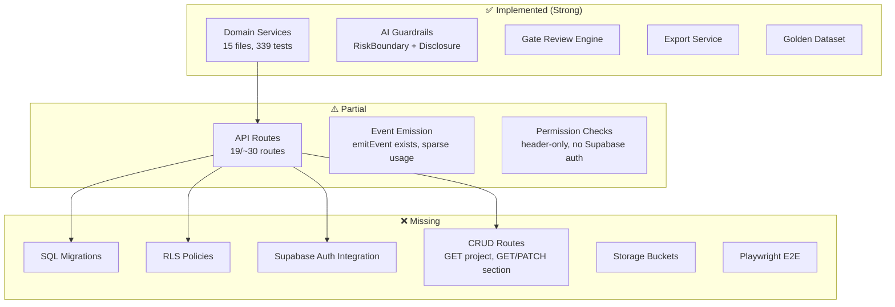

# Gap Analysis & E2E Test Scenarios

## Part 1: Spec vs Implementation Gap Analysis

### Analysis Methodology
- 38개 문서 spec 대 15개 domain service + 19개 API route + 18개 UI page 정밀 대조
- 339/339 테스트 통과 기준 현재 coverage 검증

---

### Gap Matrix

| # | Spec Reference | Required | Implemented | Gap Level | Detail |
|---|---|---|---|---|---|
| G1 | docs/12 §3.2 | `GET /api/im-projects/preview-handoff/:token` | ❌ Missing | **P0** | Preview API route 없음. handoff-service에 `createSafePreview` 함수는 존재하나 호출 route 부재 |
| G2 | docs/12 §4.1 | `POST /api/im-projects` (direct create) | ❌ Missing | P1 | Import 경로만 존재, handoff 없이 직접 프로젝트 생성 route 없음 |
| G3 | docs/12 §4.2 | `GET /api/im-projects/:id` | ❌ Missing | **P0** | 프로젝트 상세 조회 route 없음 (bssot route만 존재) |
| G4 | docs/12 §4.3 | `PATCH /api/im-projects/:id` | ❌ Missing | P1 | 프로젝트 수정 route 없음 |
| G5 | docs/12 §6.2 | `GET /api/im-projects/:id/sections` | ❌ Missing | **P0** | 섹션 목록 조회 route 없음 |
| G6 | docs/12 §6.3 | `GET /api/im-sections/:id` | ❌ Missing | P1 | 개별 섹션 조회 route 없음 |
| G7 | docs/12 §6.4 | `PATCH /api/im-sections/:id` | ❌ Missing | P1 | 섹션 수정 route 없음 |
| G8 | docs/12 §7.2 | `POST /api/im-sections/:id/rewrite` | ❌ Missing | P2 | AI 재작성 route 없음 |
| G9 | docs/12 §8.1 | `POST /api/im-projects/:id/request-expert-patch` | ❌ Missing | P1 | Expert 배정 요청 route (broker→expert) 없음 |
| G10 | docs/12 §10.1-4 | Export sub-routes (markdown/pdf/pptx/web) | ⚠️ Partial | P1 | 단일 `/export` route만 존재, 개별 format route 미분리 |
| G11 | docs/13 §10 | `transitionProjectStatus()` 서비스 | ⚠️ Partial | **P0** | section transition은 있으나 project transition 서비스 부재 |
| G12 | docs/11 §21 | RLS Policies | ❌ Missing | **P0** | SQL migration/RLS 정책 파일 전무. 모든 테이블에 RLS 없음 |
| G13 | docs/08 §7 | Permission Matrix 구현 | ⚠️ Partial | **P0** | `x-actor-role` 헤더 기반 검사만 존재, Supabase auth 연동 없음 |
| G14 | docs/14 §3 | Storage buckets 구성 | ❌ Missing | P1 | evidence_files 테이블 정의만 있고 실제 Supabase Storage bucket 미구성 |
| G15 | docs/14 §9 | Signed URL Policy | ❌ Missing | P1 | 서명 URL 생성/검증 로직 전무 |
| G16 | docs/09 §4-6 | Event emission 실행 | ⚠️ Partial | P1 | `emitEvent` 함수 존재하나 대부분 API route에서 event 미발행 |
| G17 | docs/28 §11 | Accessibility (axe-core) | ❌ Missing | P2 | a11y 테스트 전무 |
| G18 | docs/28 §9 | RLS/Permission 테스트 | ❌ Missing | **P0** | `test:rls` script 정의되어 있지 않음 |
| G19 | docs/11 §4-20 | SQL Migration 파일 | ❌ Missing | **P0** | Supabase migration SQL 전무 |
| G20 | docs/28 §10 | Playwright E2E 테스트 | ❌ Missing | P1 | Playwright 설치되었으나 spec 파일 0개 |

---

### Gap Severity Summary

| Level | Count | 설명 |
|---|---|---|
| **P0 Critical** | 7 | 상용화 차단 — 핵심 CRUD route, RLS, project transition, SQL 없음 |
| P1 High | 9 | 파일럿 품질 저하 — 직접 생성, 개별 export, storage, E2E |
| P2 Medium | 4 | 향후 개선 — rewrite, a11y, advanced features |

> [!IMPORTANT]
> **핵심 발견**: Domain service 계층(pure logic)은 매우 견고하나(339 tests), **API route 계층과 인프라 계층(RLS, migration, auth)에 심각한 공백**이 존재합니다. 현재 시스템은 "비즈니스 로직 완성 + 배관(plumbing) 미완성" 상태입니다.

---

### Architecture Gap Diagram



---

## Part 2: E2E Test Scenarios (7건)

> [!NOTE]
> 각 시나리오는 docs/33-demo-scenarios.md의 Demo A-J를 기반으로, 현재 구현된 domain service + API route를 E2E로 관통하는 통합 검증 시나리오입니다.

---

### E2E-1: Handoff → Import → Dashboard (Demo A + B)

**목적**: 핸드오프 수신부터 프로젝트 생성, 대시보드 진입까지 전체 흐름 검증

```text
Given: MVP에서 handoff token hof_demo_pilot_001 생성됨
When:
  1. POST /api/im-projects/import-from-handoff { handoff_token: "hof_demo_pilot_001" }
  2. Response에서 im_project_id 획득
  3. POST /api/im-projects/:id/readiness-check
  4. GET /im-projects/:id (UI page)
Then:
  - import 응답: status 200, im_project_id 존재
  - readiness 응답: readiness_score 0-100, available_outputs 배열
  - UI: 대시보드에 readiness score, next best action 표시
  - Events: handoff_imported, bssot_full_created, im_project_created, im_readiness_checked
Invariant:
  - protected fields (exact_address, tenant_name) preview에 미포함
  - expired token → 4xx 에러
```

**현재 Gap**: G1(preview route), G3(GET project route) 때문에 partial 검증만 가능

---

### E2E-2: Readiness → Outline → AI Draft (Demo B + C + D)

**목적**: 데이터 기반 readiness → 18섹션 outline → AI 초안 생성 파이프라인 검증

```text
Given: Import 완료된 프로젝트 proj_001 존재
When:
  1. POST /api/im-projects/:id/readiness-check
  2. POST /api/im-projects/:id/generate-outline
  3. POST /api/im-sections/:sectionId/generate-draft { prompt_version: "v1" }
Then:
  - readiness: score 산출, boundary_note 포함
  - outline: 18개 im_sections 생성, section_order 1-18 정렬
  - draft: section status → ai_draft, markdown 존재, ai_run 기록
  - RiskBoundary: safe_text에 금지 표현 미포함
  - DisclosureGuard: protected fields 자동 redact
Invariant:
  - outline 2회 실행 시 중복 섹션 미생성 (docs/28 §8.3)
  - AI draft status는 반드시 "ai_draft" (절대 buyer_ready 직행 불가)
```

---

### E2E-3: Expert Assignment → Patch → Section Update (Demo F)

**목적**: Broker→Expert 배정, 전문가 패치 제출, 섹션 갱신 워크플로우 검증

```text
Given:
  - proj_001의 income_noi_yield_analysis 섹션이 ai_draft 상태
  - expert_001이 cre_consultant 역할로 등록됨
When:
  1. Expert assignments 목록 조회 (GET /api/expert/assignments, x-actor-role: expert)
  2. Expert 배정 상세 조회 (GET /api/expert/assignments/:assignmentId)
  3. Patch 제출 (POST /api/expert-patches/:assignmentId/submit)
     - after_text: 수정된 NOI 분석
     - edit_tags: [overclaim_removed, risk_balance_added]
     - training_rights: allowed_anonymized
Then:
  - expert는 배정된 섹션만 열람 가능
  - 미배정 섹션 접근 시 403
  - patch 제출 시 expert_patch 생성
  - edit_tags 빈 배열 → 400 Validation Error
  - after_text 빈 문자열 → 400 Validation Error
  - Events: expert_patch_submitted
Invariant:
  - training_rights 기록 (golden dataset 후속 처리용)
  - visibility_after_review 기록
```

---

### E2E-4: Gate Review → P0 Block → Fix → Buyer-ready Approval (Demo E + G + H)

**목적**: Gate 검토에서 P0 위반 차단 → 수정 → 재검토 → buyer-ready 승인까지 전체 cycle 검증

```text
Given:
  - proj_001의 executive_summary에 "스타벅스 입점 중" (tenant_name 노출)
  - 모든 expert patch 완료
When:
  Phase 1 - Gate Run (P0 차단):
    1. POST /api/im-projects/:id/gate-review/run
    2. 응답: disclosure_gate=blocked, has_p0_violation=true
    3. POST /api/im-projects/:id/gate-review/approve-buyer-ready (x-actor-role: reviewer)
    4. 응답: 400 — P0 violation 차단
  Phase 2 - Fix & Re-run:
    5. 섹션 markdown에서 tenant_name 제거
    6. POST /api/im-projects/:id/gate-review/run (재실행)
    7. 응답: all gates pass, buyer_ready_eligible=true
  Phase 3 - Approval:
    8. POST approve-buyer-ready (x-actor-role: broker) → 403 (broker 불가)
    9. POST approve-buyer-ready (x-actor-role: reviewer) → 200
Then:
  - Phase 1: buyer_ready_eligible=false
  - Phase 2: buyer_ready_eligible=true
  - Phase 3: project status → buyer_ready
  - Events: gate_review_completed, buyer_ready_blocked, buyer_ready_approved
Invariant:
  - P0 disclosure는 override 불가 (docs/26 §15)
  - broker는 절대 approve 불가 (docs/08 §7)
```

---

### E2E-5: Export Guard → Draft Label → Buyer-ready Export (Demo I)

**목적**: Export 자격 검증, draft 워터마크, buyer-ready 면책조항 포함 검증

```text
Given:
  - proj_001 존재, 18섹션 draft 완료
When:
  Phase 1 - Draft Export (ai_draft 상태):
    1. POST /api/im-projects/:id/export { export_mode: "draft", export_type: "markdown" }
    2. 출력 검증
  Phase 2 - Buyer-ready 차단 (미승인):
    3. POST /api/im-projects/:id/export { export_mode: "buyer_ready" }
    4. 응답: 403 EXPORT_BLOCKED
  Phase 3 - Buyer-ready Export (승인 후):
    5. Gate pass + approve-buyer-ready 완료
    6. POST /api/im-projects/:id/export { export_mode: "buyer_ready", export_type: "markdown" }
Then:
  - Phase 1: DRAFT_LABEL 포함, STANDARD_DISCLAIMER 포함, export_job 기록
  - Phase 2: blocking_reasons에 "Reviewer/Admin 승인 필요" 포함
  - Phase 3: DRAFT_LABEL 미포함, STANDARD_DISCLAIMER 포함, buyer-ready 완본
  - Events: im_export_requested, im_exported
Invariant:
  - 모든 출력에 면책조항 필수 (docs/27 §8)
  - Draft는 "[DRAFT — AI 초안]" 워터마크 필수 (docs/27 §4)
```

---

### E2E-6: Golden Dataset → Redaction → Training Rights Guard (Demo J)

**목적**: AI+Expert 쌍 추출 → P0 필드 자동 redact → training_rights 검증 → 승인 워크플로우

```text
Given:
  - sec_08 (NOI)에 ai_draft + expert_patch 존재
  - expert_patch.training_rights = "allowed_anonymized"
  - ai_draft에 "서울 성동구 성수동2가 123-45" (exact_address) 포함
When:
  1. POST /api/golden-im-candidates { section_id: sec_08, expert_patch_id: patch_001 }
  2. 후보 생성 확인 (review_status=candidate)
  3. Redaction 실행 → exact_address 자동 제거
  4. POST /api/golden-im-candidates/:id/approve (x-actor-role: reviewer)
Then:
  - candidate.redaction_status = "redacted"
  - candidate.ai_draft에 exact_address 미포함
  - candidate.review_status = "approved"
  - Events: golden_candidate_created, golden_candidate_approved
Negative Cases:
  - training_rights="not_allowed" → approve 시 400 에러
  - redaction 미완료 → approve 차단
  - non-reviewer → approve 시 403
```

---

### E2E-7: RBAC Cross-cutting — Role Escalation Prevention

**목적**: 5개 역할(broker/expert/reviewer/admin/im_editor) 간 권한 경계 검증 (docs/08 §7 전체)

```text
Given: proj_001 존재, 각 역할의 사용자 세팅
When & Then:
  
  [broker]:
    ✅ POST import-from-handoff → 200
    ✅ POST generate-outline → 200
    ❌ POST approve-buyer-ready → 403
    ❌ POST /api/admin/* → 403

  [expert]:
    ✅ GET /api/expert/assignments → 본인 배정만
    ✅ POST expert-patches/:id/submit → 200 (배정 섹션)
    ❌ GET /api/im-projects/:id/bssot → 403 (전체 B-SSoT 접근 불가)
    ❌ POST generate-draft → 403
    ❌ POST approve-buyer-ready → 403
    ❌ POST /api/admin/* → 403

  [reviewer]:
    ✅ POST gate-review/run → 200
    ✅ POST approve-buyer-ready (gates pass) → 200
    ✅ GET /api/admin/gate-queue → 200
    ❌ POST import-from-handoff → 제한적

  [admin]:
    ✅ All routes → 200
    ✅ GET /api/admin/analytics → 200
    ✅ POST /api/golden-im-candidates/:id/approve → 200

Invariant:
  - 역할 헤더 위조 방지 (현재 x-actor-role 헤더 기반 → Supabase JWT 전환 필요)
  - protected field가 에러 메시지에 포함되지 않음
  - 모든 권한 거부 시 activity_event 기록
```

> [!CAUTION]
> E2E-7은 현재 **G12(RLS)**, **G13(auth)** gap으로 인해 완전 실행 불가. Supabase auth + RLS migration 완료 후에만 진정한 검증이 가능합니다.

---

## Priority Roadmap

```mermaid
gantt
    title Gap Resolution Priority
    dateFormat X
    axisFormat %s

    section P0 Critical
    SQL Migrations (G19)           :crit, 0, 3
    RLS Policies (G12)             :crit, 1, 4
    CRUD Routes G3+G5 (GET)        :crit, 2, 4
    Project Transition Svc (G11)   :crit, 3, 5
    Preview Handoff Route (G1)     :crit, 3, 4
    Auth Integration (G13)         :crit, 4, 6
    RLS Tests (G18)                :crit, 5, 7

    section P1 High
    PATCH Routes G4+G6+G7          :5, 7
    Export Sub-routes (G10)         :5, 6
    Expert Request Route (G9)      :6, 7
    Storage Buckets (G14)          :6, 8
    Playwright E2E (G20)           :7, 9
    Event Emission (G16)           :7, 9
```



> [!TIP]
> **권장 순서**: G19(SQL) → G12(RLS) → G3+G5(CRUD) → G13(Auth) → G20(Playwright) — 이 5개가 해결되면 E2E-1~7 전체 실행이 가능해집니다.
